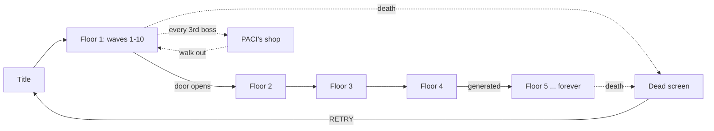

# How a run goes

Ten waves per floor. Clear wave 10 and the north door opens onto the next
floor — stronger, but you keep everything. **There is no last floor.**

## Boss waves

Bosses spawn on waves **3, 5, 7, 9, 10** (`BOSS_WAVES`). See [[Bosses]] for
who and what pattern each uses.

## The shop interlude

Every third boss kill, the post-wave pause hands you [[The Shop|PACI's back
room]] instead of the next wave — three random guns, one very large man, and a
door back. The wave clock resumes exactly where it paused when you leave.

## Per-wave loop

1. `startWave(n)` builds a monster queue sized by [[Difficulty Scaling]].
2. Enemies trickle in from cracks in the floor rather than appearing instantly
   — each crack telegraphs for 0.6–0.75s before the enemy resolves.
3. Clearing the queue **and** every enemy triggers wave-clear:
   - `+10hp` (or `+60hp` on wave 10)
   - `+1` frag grenade (capped at 6)
   - score bonus
   - **the floor vacuums**: every loose pickup drags itself to you and gets
     collected over ~2.6 seconds (`S.vacuum`) — see [[Pickups#Wave-end collection]]
4. On wave 10, the door lights up red and pulses; walking into it starts
   [[#Floor transition]].

## Floor transition

On `nextRoom()`:

- A new floor is generated (bigger arena, darker palette, one of five
  [[Rendering#Arena layouts|layout archetypes]])
- Player heals `+45hp`, gets `+2` frags, all owned weapons refill their mags
- **The base rifle gets a new mark** — see [[Progression#The evolving rifle]]
  — with the GLUSEC banner along the bottom of the screen
- [[Music]] shifts key and tempo for the new floor

Past floor 4 the floor definition is **generated** rather than authored — name,
palette, arena size and darkness all derive from the floor index, so the
descent has no bottom. See [[Progression#Endless floors]].

## Ending a run

Death is permanent for the run's *level, items, and equipped weapons* — but
**coins, cards, and the vault survive** (see [[Economy]]). The death screen
offers RETRY, COSMETICS, EVOLVE, RESET EVO, and TITLE.

## Related
- [[Difficulty Scaling]] — every formula behind "harder"
- [[Progression]] — XP, levels, upgrades, the rifle
- [[Secrets]] — the three things not covered by any of the above
