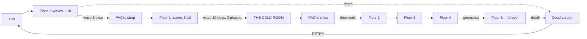

# How a run goes

Ten waves per floor. Clear wave 10, spend your money, and the north door opens
onto the next floor — stronger, but you keep everything. **There is no last
floor.**

## The shape of a floor

| wave | what's in it |
|---|---|
| 1–3 | ordinary waves |
| **4** | an [[Bosses#Elites\|elite]] — this is what opens tier 1 of [[The Deck\|the deck]] |
| **5** | ordinary wave — then **[[The Shop\|PACI's back room]]** |
| 6–7 | ordinary waves |
| **8** | the second elite |
| 9 | ordinary wave |
| **10** | the [[Bosses\|floor boss]], **[[Bosses#Two phases\|two phases]]** — or an **APEX** on floors 5, 10, 15 … |
| — | [[Groceries#THE COLD ROOM\|THE COLD ROOM]] — pick one of two signatures |
| — | **PACI again**, then the door north |

Three boss-class kills a floor, all of which hand you a card; only the
tenth-wave boss opens the cold room and deck tier 2.

**PACI keeps wave hours, not boss hours** — `SHOP_WAVES = [5, 10]`. The
half-time shop is the one that changes how you fight the back half of a floor;
the wave-10 one is where you spend the floor's takings before descending.

Somewhere in a corner, on about **60% of floors**, [[Augments|TOMCE]] is
standing with three trades. He is never in the corner the
[[Secrets#2. MODAGAZ|sigil]] is in.

## Per-wave loop

1. `startWave(n)` builds a monster queue sized by [[Difficulty Scaling]].
2. Enemies trickle in from cracks in the floor rather than appearing instantly
   — each crack telegraphs for 0.75s before the enemy resolves.
3. Clearing the queue **and** every enemy triggers wave-clear:
   - `+12hp` (or `+30hp` on wave 10)
   - `+1` frag grenade, plus one per MUNITIONS rank (capped at 9)
   - a score bonus of `100 * wave * (floor + 1)`
   - one parting drop, ammo 78% of the time
   - **the floor vacuums**: every loose pickup drags itself to you over ~2.6
     seconds — see [[Pickups#Wave-end collection]]
4. On wave 10, the door lights up red and pulses; walking into it starts
   [[#Floor transition]].

Between waves there is a 3-second pause. If a shop is owed, it takes that slot
instead of the next wave.

## Floor transition

On `nextRoom()`:

- A new floor is generated (bigger arena, darker palette, one of five
  [[Rendering#Arena layouts|layout archetypes]])
- Player heals `+30hp`, gets `+2` frags, all owned weapons refill their mags
- `S.savesLeft` is reset to your SECOND HELPING rank — the refusals are
  **per floor**, not per run
- **The sidearm gets a new mark** — see
  [[Progression#The evolving sidearm]] — with the GLUSEC banner along the
  bottom of the screen
- [[Music]] shifts key and tempo for the new floor

Past floor 4 the floor definition is **generated** rather than authored — name,
palette, arena size and darkness all derive from the floor index, so the
descent has no bottom. See [[Progression#Endless floors]].

## Ending a run

Death is permanent for the run's level, deck, augments, items and weapons —
but **coins, cards, the vault and every [[Contracts|contract]] survive**. See
[[Economy#What resets, and when]].

The death screen offers RETRY, COSMETICS, EVOLVE, RESET EVO, and TITLE. Pause
also carries **MAIN MENU**, which abandons the run deliberately: everything
that survives death is persisted continuously, so quitting costs exactly the
floor you're standing on. It is the death path minus the death.

## Related
- [[Difficulty Scaling]] — every formula behind "harder"
- [[The Deck]] — what the three boss kills a floor actually pay out
- [[Secrets]] — the three things not covered by any of the above
