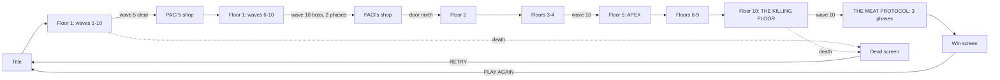

# How a run goes

Ten waves per floor, **ten floors**, and then it is over. Clear wave 10, spend
your money, and the north door opens onto the next floor — stronger, but you
keep everything. The tenth floor has no door.

> [!note] The descent used to have no bottom
> Four authored floors and a generator past them. It never ran out, which
> meant it never resolved either — no act structure, no finale, and the only
> way a run could end was badly. Ten authored floors and a boss that closes
> the building is the version where **winning is a thing that can happen**.
> See [[Floors]].

## The shape of a floor

| wave | what's in it |
|---|---|
| 1–3 | ordinary waves |
| **4** | an [[Bosses#Elites\|elite]] — this is what opens tier 1 of [[The Deck\|the deck]] |
| **5** | ordinary wave — then **[[The Shop\|PACI's back room]]** |
| 6–7 | ordinary waves |
| **8** | the second elite |
| 9 | ordinary wave |
| **10** | the [[Bosses\|floor boss]], **[[Bosses#Phases\|two phases]]** — an **APEX** on floor 5, **[[Bosses#THE MEAT PROTOCOL\|THE MEAT PROTOCOL]]** on floor 10 |
| — | **PACI again**, then the door north |

Three boss-class kills a floor, all of which hand you a card; only the
tenth-wave boss opens deck tier 2.

On [[Floors|THE LAST AISLE]] the `hunt` twist moves the elites to waves **3, 6
and 8** — four boss-class kills on that floor instead of three, which is the
floor's whole reward for being the worst one to walk through.

**PACI keeps wave hours, not boss hours** — `SHOP_WAVES = [5, 10]`. The
half-time shop is the one that changes how you fight the back half of a floor;
the wave-10 one is where you spend the floor's takings before descending.

Somewhere in a corner, on about **60% of floors**, [[Augments|TOMCE]] is
standing with three trades. He is never in the corner the
[[Secrets#2. MODAGAZ|sigil]] is in.

## Per-wave loop

1. `startWave(n)` builds a monster queue sized by [[Difficulty Scaling]].
2. Enemies trickle in from cracks in the floor rather than appearing instantly
   — each crack telegraphs for 0.75s before the enemy resolves.
3. Clearing the queue **and** every enemy triggers wave-clear:
   - `+12hp` (or `+30hp` on wave 10)
   - `+1` frag grenade, plus one per MUNITIONS rank (capped at 9)
   - a score bonus of `100 * wave * (floor + 1)`
   - one parting drop, ammo 78% of the time
   - **the floor vacuums**: every loose pickup drags itself to you over ~2.6
     seconds — see [[Pickups#Wave-end collection]]
4. On wave 10, the door lights up red and pulses; walking into it starts
   [[#Floor transition]].

Between waves there is a 3-second pause. If a shop is owed, it takes that slot
instead of the next wave.

## Floor transition

On `nextRoom()`:

- The next of the ten [[Floors|authored floors]] is built — its own palette,
  arena size, [[Rendering#Arena layouts|layout]], [[Floors#Props|prop set]],
  [[Floors#Walls|wall treatment]] and [[Floors#Twists|twist]]
- Player heals `+30hp`, gets `+2` frags, all owned weapons refill their mags
- `S.savesLeft` is reset to your SECOND HELPING rank — the refusals are
  **per floor**, not per run
- **The sidearm gets a new mark** — see [[Progression#The evolving sidearm]]
- The floor's name and subtitle come up for 4 seconds, and its **twist is
  announced 4.4 seconds in**, after the name has finished being read
- [[Music]] shifts key and tempo for the new floor

`S.introT = 2.6` holds wave 1 off in **game time**, so opening a menu pauses
the opening beat rather than consuming it — see
[[Bugs Found#14. A menu inside the first 2.2 seconds killed the floor permanently]].

## Winning

Kill [[Bosses#THE MEAT PROTOCOL|THE MEAT PROTOCOL]] on floor 10 wave 10 and the
run **ends**. The kill clears the room — bullets, hazards, cracks, the deferred
effect queue, and anything still breathing — banks the score, and counts down
3.4 seconds into the [[Rendering#The win screen|win screen]].

It signs **CLOSING TIME** ([[Contracts]]), and the win screen's one editorial
line points at the only thing left to do: *EVOLVE and come back holding
something.* An [[Economy#Evolution|evolved]] roster makes the next ten floors a
different ten floors.

## Ending a run badly

Death is permanent for the run's level, deck, augments and weapons — but
**coins, cards, the vault and every [[Contracts|contract]] survive**. See
[[Economy#What resets, and when]].

The death screen offers RETRY, COSMETICS and TITLE, centred on one row; the win
screen offers PLAY AGAIN, COSMETICS and TITLE in the same shape and the same
place, because it is the same screen with the temperature turned around. Pause
carries THE DECK, COSMETICS, **EVOLVE**, RESET EVO and **MAIN MENU** — the last
of which abandons the run deliberately: everything that survives death is
persisted continuously, so quitting costs exactly the floor you're standing on.
It is the death path minus the death.

> [!note] EVOLVE is a pause-screen button now
> It was on the title and death screens. It **restarts the run**, so it belongs
> on the one screen where the run is in front of you and the coins it takes are
> on the same strip — see [[Economy#Evolution]]. RESET EVO moved with it, and
> for the same reason: it empties the permanent roster, so the run has to go
> too.

## Related
- [[Floors]] — the ten of them, and the rule each one runs under
- [[Difficulty Scaling]] — every formula behind "harder"
- [[The Deck]] — what the three boss kills a floor actually pay out
- [[Secrets]] — the three things not covered by any of the above
